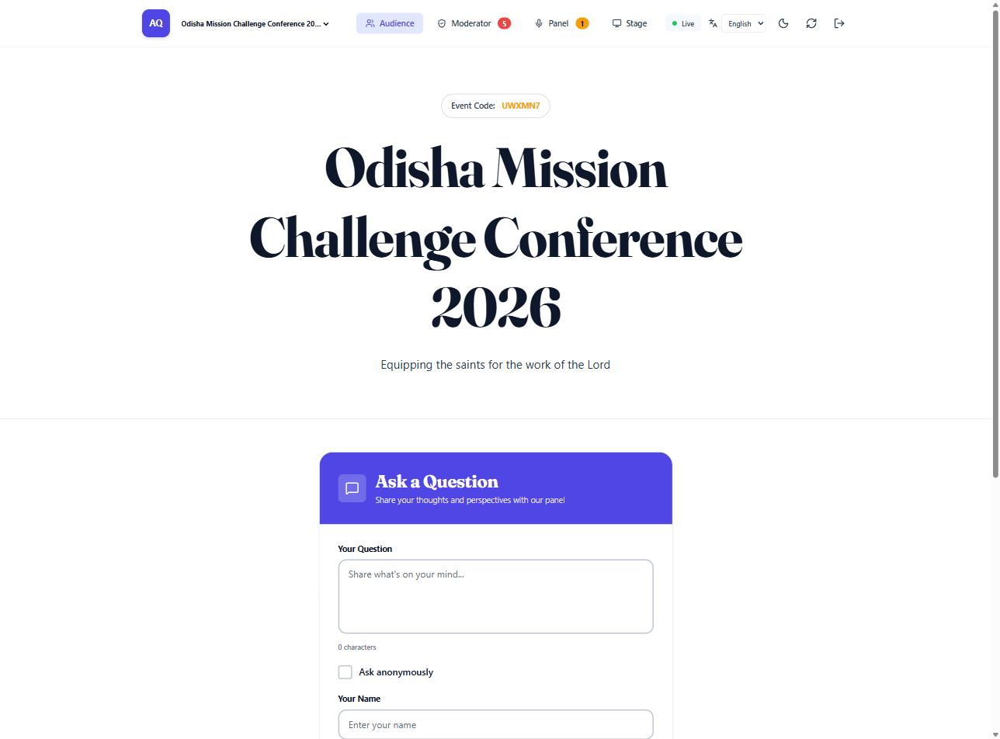
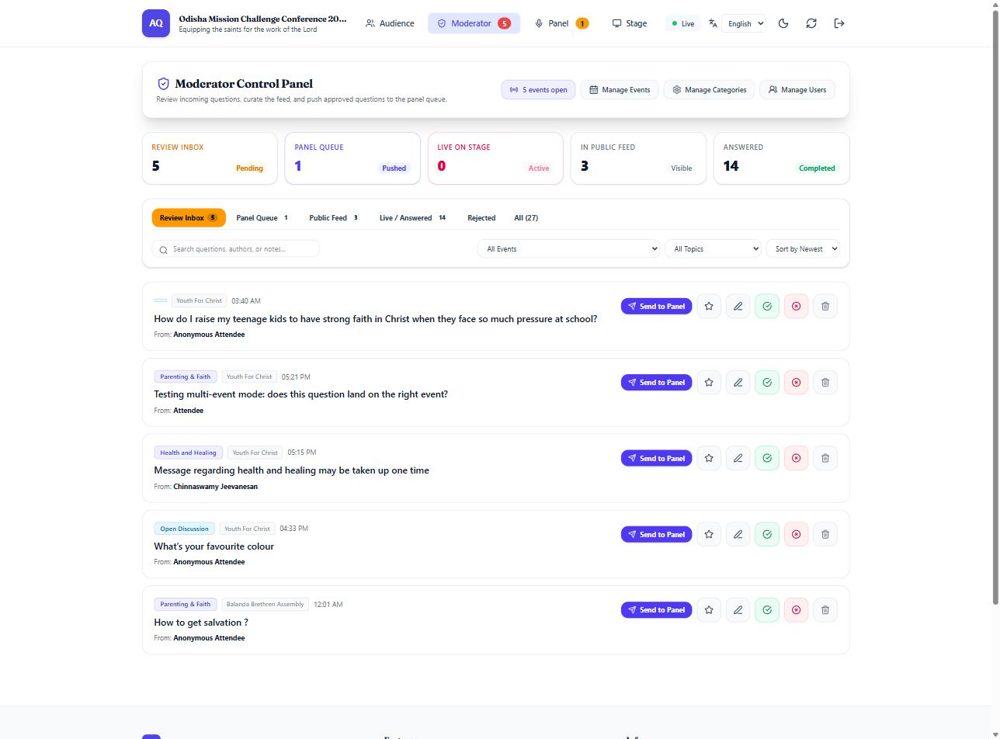
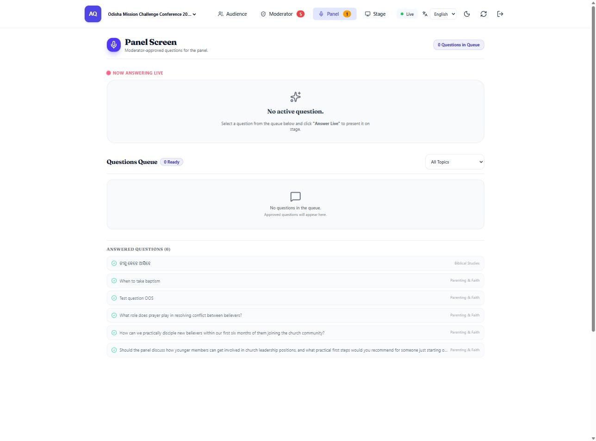
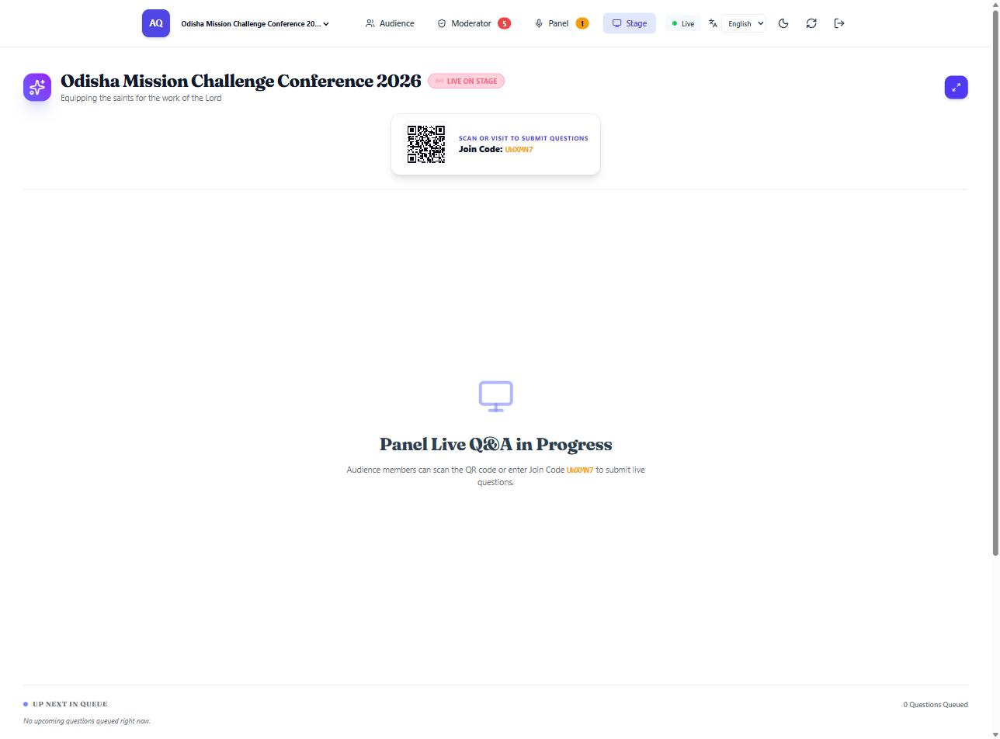
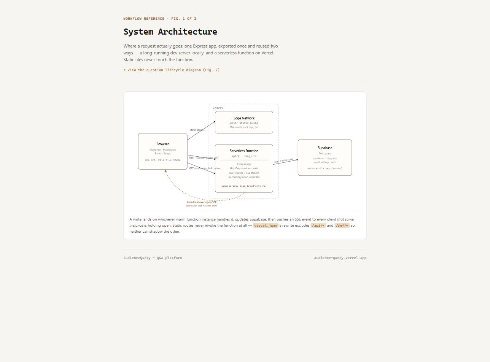
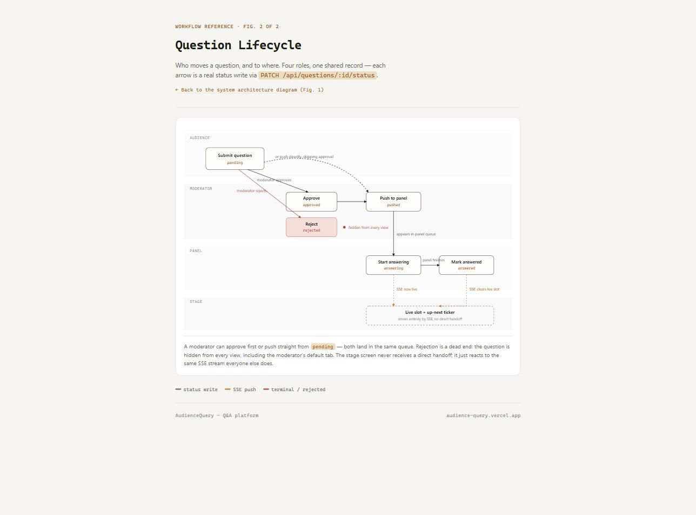

# AudienceQuery

A real-time, interactive Q&A platform designed for live events, conferences, and panels. Originally a single-event demo, it's now a multi-tenant, role-based platform backed by Supabase, supporting concurrent events, internationalization, and automated content classification. It empowers audience members to submit questions, while giving moderators and panelists the tools to manage, prioritize, and display them seamlessly.

## Screenshots

| **Audience View** | **Moderator View** |
| :---: | :---: |
|  |  |
| The audience's mobile-first view for submitting questions. | The moderator's command center for managing the event. |
| **Panel View** | **Stage View** |
|  |  |
| The panel's dedicated screen for viewing the question queue. | The main projector view for the live audience. |


## System Architecture

The system is built on a modern, serverless architecture using Vercel for the frontend and API, with Supabase as the backend for database and authentication.

| **System Architecture** | **Question Lifecycle** |
| :---: | :---: |
|  |  |
| View interactively: [System Architecture](https://audience-query.vercel.app/ref/tech-diag) | View interactively: [Question Lifecycle](https://audience-query.vercel.app/ref/user-diag) |

## Roles & Access

The platform supports four distinct user roles, managed via Supabase Auth and a dedicated `users` table.

-   **Admin**: Full control over the entire system. Admins can manage users, events, and categories, and have access to all views, including the `/logs` page.
-   **Moderator**: Manages the flow of questions for events. They can approve, reject, edit, and push questions to the panel. They can also manage events and categories but not users.
-   **Panelist**: A restricted role with access only to the Panel View (`/panel`), where they can see the queue of questions pushed by the moderator and mark them as they are being answered.
-   **Stage**: A restricted role with access only to the Stage View (`/stage`), which is projected for the live audience.

## Multi-Event Mode

The application is a multi-tenant platform capable of running multiple events concurrently.

-   **Join-Code Routing**: Each event is accessed via a unique join code through the URL (`/e/:joinCode`).
-   **Concurrent Events**: Any number of events can be active and accept questions simultaneously.
-   **Event Expiry**: Events can have an optional expiration time, after which they no longer accept submissions.
-   **Event Picker**: Visitors to the root URL are presented with a list of currently open events to choose from.

## Key Functional Views & Features

### 📱 Audience Submission Interface
- **Mobile-Optimized Submission**: Audience members can submit questions with their name or anonymously.
- **Automatic Classification**: Questions are automatically categorized using the Gemini API, removing the need for manual topic selection.
- **Live Status Badges**: Audience members track their submitted questions through stages: In Review → Pushed to Panel → Answering Live 🎙️ → Answered.
- **Internationalization**: The interface is available in English, Hindi, and Odia.

### 🛡️ Backend Moderator Bridge Dashboard
- **Command Central**: Bridges incoming audience questions and stage panelists.
- **Categorized Inbox**: Filter by Inbox Pending, Pushed to Panel, Approved Public Feed, Live/Answered, and Rejected.
- **Management Drawers**: Dedicated UI for managing Events, Categories, and Users (Users drawer is admin-only).
- **Translate Assist**: A "Translate" button provides draft translations for event and category names into Hindi and Odia.
- **Admin Logs**: Admins have access to a dedicated `/logs` page to view application logs.

### 🎙️ Panel Members' Live Screen (`/panel`)
- **High-Legibility Stage View**: Designed for tablets/laptops on the panel desk.
- **Live Answering Control**: Click "Start Answering Live" to instantly feature a question on the main auditorium stage screen.
- **Live Timer**: Tracks elapsed answering time per question.

### 📺 Projected Stage Screen (`/stage`)
- **Widescreen Auditorium Projection**: High-impact stage view showing the currently active question.
- **Upcoming Queue Ticker**: Displays upcoming panel questions waiting in line.
- **Audience Access Badge**: Displays the event join code and a scannable QR code.

## Tech Stack

- **Frontend**: React (Vite), TypeScript, Tailwind CSS
- **Backend**: Node.js, Express.js on Vercel Serverless Functions
- **Database & Auth**: Supabase (PostgreSQL)
- **Real-time Communication**: Server-Sent Events (SSE)
- **AI**: `@google/genai` for question classification.
- **Internationalization (i18n)**: `i18next` and `react-i18next` for English, Hindi, and Odia. `google-translate-api-x` for translation assistance.
- **Deployment**: Vercel & Docker

## Getting Started

### Prerequisites
- Node.js (v20 or later)
- npm or yarn
- Docker (optional)

### 1. Installation & Environment Setup

Clone the repository, install dependencies, and set up your environment variables.

```bash
git clone <repository-url>
cd AudienceQuery
npm install
cp .env.example .env
```

Now, edit the `.env` file and add your credentials.
```
VITE_SUPABASE_URL=YOUR_SUPABASE_URL
VITE_SUPABASE_ANON_KEY=YOUR_SUPABASE_ANON_KEY
SUPABASE_SERVICE_ROLE_KEY=YOUR_SUPABASE_SERVICE_ROLE_KEY
GEMINI_API_KEY=YOUR_GEMINI_API_KEY
```

### 2. Running in Development Mode

This command starts the Vite frontend and the Express backend server with live-reloading.
```bash
npm run dev
```
The application will be available at `http://localhost:3000`.

### 3. Running with Docker

You can also run the application using the provided Dockerfile.

```bash
# Build the image
docker build -t audience-query .

# Run the container, passing in your .env file
docker run --env-file .env -p 3000:3000 audience-query
```

## Project Structure

```
.
├── api/
│   └── index.ts            # Vercel Serverless Function entry point
├── database/
│   └── schema.sql          # Supabase PostgreSQL schema
├── public/
│   ├── favicon.svg
│   └── ref/                  # Static reference diagrams
├── src/
│   ├── components/         # React components for different views
│   ├── i18n/               # Internationalization setup and locales
│   ├── App.tsx             # Main React application component
│   ├── main.tsx            # React entry point
│   ├── supabaseClient.ts   # Supabase client configuration
│   ├── types.ts            # TypeScript type definitions
│   └── useRealTimeQnA.ts   # Custom hook for SSE connection and state management
├── .env.example
├── Dockerfile
├── package.json
├── server.ts               # Express.js backend server logic
└── vercel.json             # Vercel deployment configuration
```

## API Endpoints

The Express server provides a REST API and a Server-Sent Events (SSE) stream.

-   `GET /api/me`: Returns the current authenticated user's profile and role.
-   `POST /api/session`: Issues a new HttpOnly session cookie (`qna_session_id`) for an unauthenticated visitor; required before calling `GET /api/state`.
-   `GET /api/stream`: Establishes an SSE connection for real-time updates.
-   `GET /api/state`: Retrieves the current state (questions/categories/event) for the event identified by `?event=<joinCode>`; requires the `qna_session_id` cookie from `POST /api/session`.
-   `GET /api/events/open`: Returns a list of all currently open and unexpired events.
-   `POST /api/questions`: Submits a new question to a specific event.
-   `PATCH /api/questions/:id/status`: Updates the status of a question.
-   `PATCH /api/questions/:id`: Edits the details of a question.
-   `DELETE /api/questions/:id`: Deletes a question.
-   `POST /api/categories`: Adds a new category.
-   `GET /api/events`: (Admin/Mod) Lists all events.
-   `POST /api/events`: (Admin/Mod) Creates a new event.
-   `PATCH /api/events/:id`: (Admin/Mod) Updates an event's configuration.
-   `GET /api/users`: (Admin only) Lists all users and their roles.
-   `PATCH /api/users/:id`: (Admin only) Updates a user's role or username.
-   `POST /api/translate`: (Admin/Mod) Gets draft translations for text.
-   `GET /api/logs`: (Admin only) Retrieves application logs.
-   `POST /api/reset`: (Admin only) DESTRUCTIVE. Resets all questions and categories.
